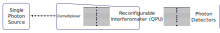

Background
==========

.. This should probably include some references!!

Lightworks is designed to enable the configuration of linear optic interferometers for Discrete-Variable quantum computing. These linear interferometers have application in both the qubit and boson sampling paradigms of quantum computing.

A typical system configuration is shown in the image below.

The process begins with a single-photon source (SPS), which generates a temporally separated train of single photons at regular intervals. The demultiplexer then uses fast switching to convert this into a set of spatially separated photons, with delay lines used to shift these photons into the same time bin. Once aligned, the created multi-photon input will enter the QPU, through which the photons will propagate while interfering with each other. The exact nature of this interference will depend on the QPU configuration. The photons then exit the QPU, at which point they are then measured to determine the results of the computation.

Boson Sampling
--------------

A reference to boson sampling :cite:p:`aaronson2010computational`.

Qubit-based Computing
---------------------