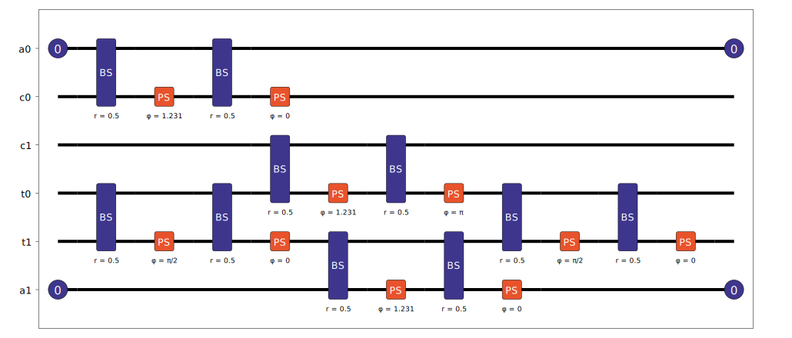
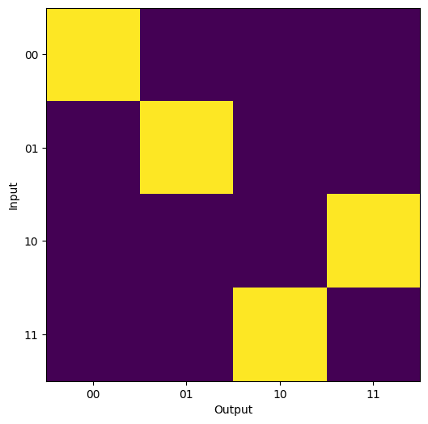

Analyzer
========

The :doc:`../sdk_reference/tasks/analyzer` object provides a set of tools to enable a better understanding of the functionality of a circuit under a set of post-selection criteria. The provision of this criteria before computation enables the Analyzer to filter down the possible output states from a given target input, reducing the number of states that it needs to calculate the permanent for.

To test the Analyzer, we will use the CNOT gate from :cite:p:`ralph2002`, as this is a useful demonstration of all analyzer features. For successful operation, it requires that at the output there are no output photons measured on the upper and lower modes, and also that only one photon exists across each of the two modes used to define each qubit. For the former condition, we will integrate these into the circuit with the ``herald`` method. This means we don't need to consider these modes when specifying inputs and outputs of the Analyzer. The latter condition is included later as part of the setup of the Analyzer.

To begin, the circuit is first defined:

.. code-block:: Python

    import numpy as np

    cnot_circuit = lw.PhotonicCircuit(6)

    theta = np.arccos(1/3)
    to_add = [(3, np.pi/2, 0), (0, theta, 0), (2, theta, np.pi), (4, theta, 0), 
              (3, np.pi/2, 0)]

    for m, t, p in to_add:
        cnot_circuit.bs(m, reflectivity = 0.5)
        cnot_circuit.ps(m+1, t)
        cnot_circuit.bs(m, reflectivity = 0.5)
        cnot_circuit.ps(m+1, p)

    # Then add required heralds
    cnot_circuit.herald(0, 0)
    cnot_circuit.herald(0, 5)

    cnot_circuit.display(mode_labels = ["a0", "c0", "c1", "t0", "t1", "a1"])

The Analyzer should then be configured. This requires the circuit and an input or list of States (providing these have the same photon number). In this case we will use all possible qubit inputs for the system. As discussed earlier, the heralded modes are excluded from the inputs/outputs so only 4 mode States need to provided.

.. code-block:: Python

    # Store inputs in both qubit and mode language
    inputs = {"00" : lw.State([1,0,1,0]),
              "01" : lw.State([1,0,0,1]),
              "10" : lw.State([0,1,1,0]),
              "11" : lw.State([0,1,0,1])}
    states = list(inputs.values())

    analyzer = lw.Analyzer(cnot_circuit, states)

The conditions for success of the gate then need to be added. As mentioned, the upper and lower modes of the circuit (a0 and a1) are reserved as ancillary modes and should have no photons at the input and output. This is captured by the addition of heralds to the original circuit.

The other condition for success of the CNOT gate is that one photon is measured across the c0 & c1 modes and another across the t0 & t1 modes. These conditions can be applied with the ``post_selection`` attribute, which can be provided with functions or a PostSelection object to condition the measurement output. In this case the condition would be:

.. code-block:: Python

    analyzer.post_selection = lambda s: s[0] + s[1] == 1 and s[2] + s[3] == 1

Once the required conditions have been defined, then the Analyzer can be run by using the permanent backend.
    
.. code-block:: Python

    results = emulator.Backend("permanent").run(analyzer)

The results from this can then be plotted to view the transformation. The returned :doc:`../sdk_reference/results/simulation_result` object contains a plotting method, but in this case it is useful to convert from mode to qubit language and plot manually.

.. code-block:: Python

    import matplotlib.pyplot as plt

    # Create new array with data
    plot_array = np.zeros((len(inputs), len(inputs)))
    for i, istate in enumerate(inputs.values()):
        for j, ostate in enumerate(inputs.values()):
            plot_array[i,j] = results[istate, ostate]

    in_labels = list(inputs.keys())
    out_labels = in_labels

    # Create image plot
    plt.figure(figsize = (7,6))
    plt.imshow(plot_array)
    plt.xticks(range(len(out_labels)), labels = out_labels)
    plt.yticks(range(len(in_labels)), labels = in_labels)
    plt.xlabel("Output")
    plt.ylabel("Input")
    plt.show()

As can be seen from the output above, the CNOT gate operates as expected, with the target qubit flipping when the control qubit is set to 1. From the Analyzer it is also possible to calculate the success rate of the system under the provided condition set. In this case we find:

.. code-block:: Python

    print(results.performance)
    # Output: 0.11111111111111126

This is ~ 1/9, the expected success rate for the gate.