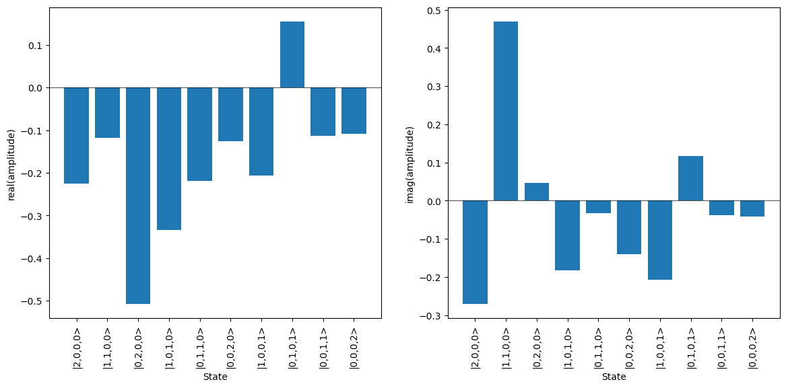

Backends
========

To use the emulator, a target backend needs to be defined which a simulation task can be run against. Emulator backends are selected and interfaced with via the :class:`Backend <lightworks.emulator.Backend>` object. 

The following backends are currently implemented within the emulator:

.. list-table:: Backend comparison
    :widths: 20, 40, 40
    :header-rows: 1

    * - Name
      - Functionality
      - Compatibility
    * - permanent
      - Probability amplitude, probability distribution
      - Analyzer, Sampler, Simulator
    * - slos
      - Probability distribution
      - Sampler

Usage
-----

To use a backend, it must first be defined by supplying the name to the ``Backend`` object. In this case the permanent backend is selected.

.. code-block:: Python

    backend = emulator.Backend("permanent")

A target task, such as the ``Simulator``, should then be configured. 

.. code-block:: Python

    circuit = lw.Unitary(lw.random_unitary(4, seed = 11))
    state = lw.State([1, 0, 1, 0])

    sim = lw.Simulator(circuit, state)

The task can then be run against the backend with the ``run`` method, this will return a results object.

.. code-block:: Python

    results = backend.run(sim)

Alternatively, the run method can be excluded and a function call made directly to the backend, so the equivalent code to above would be: 

.. code-block:: Python

    results = backend(sim)

The results can then be viewed using one of the built-in methods, such as plot.

.. code-block:: Python

    results.plot()

