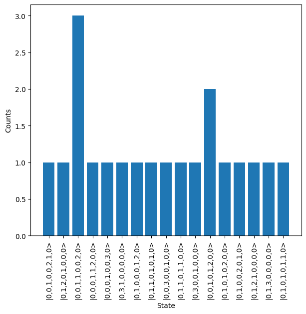

Quick Sampler
=============

The :doc:`../emulator_reference/quick_sampler` is a modified and simplified version of the Sampler, designed to provide improved sampling performance when a set of conditions are true. These conditions are:

#. Photon number is preserved between the input and output.
#. The source and detection aspects of the system are both ideal, with the only supported imperfection being if the detectors are photon number resolving or not.

Usage
-----

To use the QuickSampler, first a circuit needs to be defined. In this case, we'll generate a random unitary matrix using the ``random_unitary`` function and then convert this into a circuit with the ``Unitary`` object.

.. code-block:: Python

    U = lw.random_unitary(8, seed = 101)

    circuit = lw.Unitary(U)

The QuickSampler can then be created, providing the created circuit and the target input state. Optionally, it can also be specified whether to use photon number resolving detectors with the ``photon_counting`` argument, for now this will be set to the default value of True.

.. code-block:: Python

    input_state = lw.State([1,0,1,0,1,0,1,0])

    quick_sampler = emulator.QuickSampler(circuit, input_state, 
                                          photon_counting = True)

It is also possible to add a herald function to the QuickSampler. This could be included in the initial object creation using the ``herald`` option, but can also be added after creation using the herald attribute. This is also true for any of the other options used in creation of the QuickSampler.

.. code-block:: Python
    
    quick_sampler.herald = lambda s: s[0] == 0 and s[7] == 0

The probability distribution can then be sampled from, using either ``sample`` to get individual samples or ``sample_N_outputs`` to get N valid outputs from the system. The latter is used below, where the return is a :doc:`../emulator_reference/sampling_result` object, through which the built-in plotting can be used to quickly view the initial results.

.. code-block:: Python

    # Get 20 samples from system
    results = quick_sampler.sample_N_outputs(20, seed = 61)
    # Plot output from function
    results.plot()

Comparison
----------

As mentioned, the QuickSampler should provide some performance benefit over the Sampler in certain situations. This is particularly noticeable when many loss elements include. To demonstrate this, a unitary circuit is generated, and then 3 loss components are added to each mode.

.. code-block:: Python

    from time import perf_counter

    # Redefine circuit and add loss components
    U = lw.random_unitary(8, seed = 101)
    circuit = lw.Unitary(U)
    for i in range(8):
        for j in range(3):
            circuit.add_loss(j, lw.transmission_to_db_loss(0.9))

    input_state = lw.State([1,0,1,0,1,0,1,0])

    # QuickSampler
    t0 = perf_counter()
    quick_sampler = emulator.QuickSampler(circuit, input_state)
    quick_sampler.probability_distribution
    t1 = perf_counter()
    
    # Sampler
    t2 = perf_counter()
    sampler = emulator.Sampler(circuit, input_state)
    sampler.probability_distribution
    t3 = perf_counter()

    print(t1-t0)
    # Output: 0.02416629999061115
    print(t3-t2)
    # Output: 2.073588400002336

As can be seen, in the example above the QuickSampler was ~100x faster (although these times will vary across machines), but this comes at the cost of only exploring a restricted version of the system. Above, the ``probability_distribution`` attribute is called, the reason for this is that both the Sampler and QuickSampler will not calculate the distribution until this occurs, so this is required to find the true computation time. 
