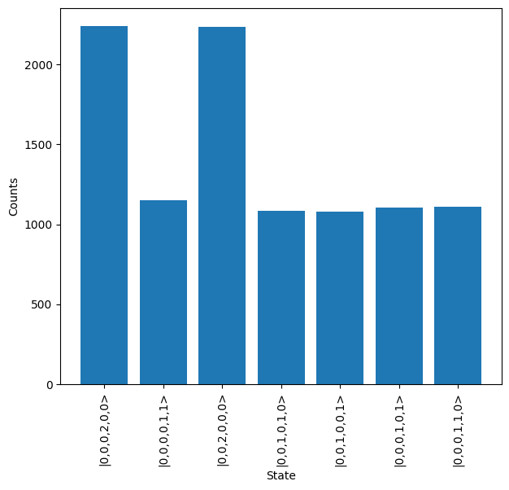

Sampler
=======

The Sampler can be used to simulate the process of running jobs with an interferometer-based photonic system, in which the same input is placed into the system many times and the output distribution measured. As this output from the system is inherently probabilistic the output distribution will tend towards the true distribution as more samples are collected. The number of samples collected from the system will depend on resource constraints, but will never be infinite, meaning there will always be some small variation from the ideal distribution. 

As sampling is how the system is utilised, it is very useful to be able to understand how the process will look like for a given job. To demonstrate sampling we will show how the 2 qubit CNOT gate from (insert reference) can be tested with the emulator. The circuit to define this gate is shown below, it occupies 6 modes where the 4 central modes c0, c1, t0 & t1 are used for qubit encoding. 

.. code-block:: Python

    import numpy as np

.. code-block:: Python

    cnot_circuit = lw.Circuit(6)

    theta = np.arccos(1/3)
    to_add = [(3, np.pi/2, 0), (0, theta, 0), (2, theta, np.pi), (4, theta, 0), 
              (3, np.pi/2, 0)]

    for m, t, p in to_add:
        cnot_circuit.add_bs(m, reflectivity = 0.5)
        cnot_circuit.add_ps(m+1, t)
        cnot_circuit.add_bs(m, reflectivity = 0.5)
        cnot_circuit.add_ps(m+1, p)

.. include display here

Note that this CNOT gate requires a set of post-selection criteria to function correctly, but this will be discussed more later. We can view the created CNOT gate with ``display``. Mode labels can be specified to mark the ancillary (a) control qubit (c) and target qubit (t) modes.

.. code-block:: Python

    cnot_circuit.display(mode_labels = ["a0", "c0", "c1", "t0", "t1", "a1"])

.. image:: assets/cnot_circuit.svg
    :scale: 100%
    :align: center

An input state to the system also needs to be defined. In this case, we'll choose the qubit state :math:`\ket{10}`, which should produce the state :math:`\ket{11}` after the CNOT. Using the circuit above, it can be seen that :math:`\ket{10}` translates to an input photon on mode c1 and t0, so the input state should be:

.. code-block:: Python

    input_state = lw.State([0,0,1,1,0,0])

Sampling
--------

Once the circuit and input state are defined, these can then be used in the creation of the Sampler object.

.. code-block:: Python

    sampler = emulator.Sampler(cnot_circuit, input_state)

It is possible to view the output probability distribution by accessing the ``probability_distribution`` attribute, but this is not really the intended functionality of the Sampler. Instead, one of the sample methods should be used to simulate the process of generating samples from the system. The most commonly used will be ``sample_N_states``, which will replicate the process of using the target input state to the system N times and measuring the output. For example, to generate 10000 samples the following is used:

.. code-block:: Python
    
    results = sampler.sample_N_states(10000, seed = 1)

The method also supports supplying a random seed for the creation of repeatable results. This returns a :doc:`../emulator_reference/sampling_result` object. This has a range of useful functionality, but primarily the ``plot`` method can be used to view the output counts from the sampling experiment. ``show = True`` can be used to directly display the created plot.

.. code-block:: Python

    results.plot(show = True)

For the plot above, it can be seen there is no clear output, which is expected as the post-selection rules have not yet been applied. This is implemented in the next section.

The other sample methods are ``sample``, which is used to generate single outputs from the system and ``sample_N`` which will total the expected number of photon counts for each mode of the system when using N inputs.

.. code-block:: Python

    print(sampler.sample())
    # Output: |0,0,1,0,0,1> (Your output will vary here)

    print(sampler.sample_N(10000, seed = 2))
    # Output: [0, 0, 6778, 6670, 3290, 3262]

Post-selection & Heralding
^^^^^^^^^^^^^^^^^^^^^^^^^^

As mentioned, post-selection/heralding is required for the CNOT gate above to work correctly. In particular, the gate requires that no photons are measured on the a0 & a1 modes. Additionally, there is a condition that only one photon is measured across c0 & c1 and another across t0 & t1. These can be implemented in the ``sample_N_states`` method by providing a function to the ``herald`` option. This can either be a dedicated function or can use the lambda function included with Python, but must take a single argument as the input, with this argument expected to be a State object. There is also a ``post_select`` option, which is used to set the minimum number of photons that should be detected at the output. In this case the function we supply will enforce this condition and so it is not necessary. 

.. code-block:: Python

    # Define heralding function
    def herald(s):
        return not s[0] and not s[5] and sum(s[1:3]) == 1 and sum(s[3:5]) == 1

    # Also define as equivalent lambda function
    herald = lambda s: not s[0] and not s[5] and sum(s[1:3]) == 1 and sum(s[3:5]) == 1

    # Sample from the system again
    results = sampler.sample_N_states(10000, herald = herald, seed = 1,
                                      post_select = 2) # Not needed

    # View results
    results.plot(show = True)

.. image:: assets/cnot_results_heralded.png
    :scale: 100%
    :align: center

It can be seen from the output that the correct state is now measured, as :math:`\ket{001010}` is equivalent to :math:`\ket{11}` in qubit language. One important thing to notice is that the number of measured outputs is significantly less than the 10,000 inputs. This results from the 1/9 success probability of the gate, and the fact that the ``sampler_N_states`` method will generate 10,000 samples from an unconstrained system, and then filter any which don't meet the criteria. This is analogous to the process that would occur in real systems.