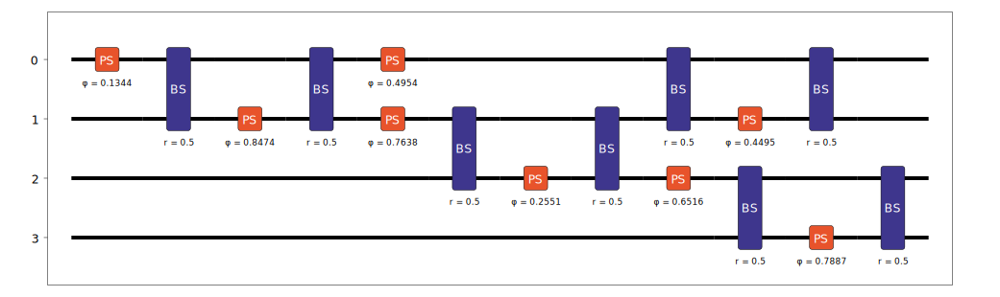

Simulator
=========

The :doc:`../emulator_reference/simulator` object is used to find the probability amplitudes of different states for a given input state. This means the expected output from a given input can be calculated precisely. It can be useful to do this as it enables a better understanding of the exact quantum state evolution, and also is much quicker/more accurate than sampling many times to find the output distribution.

Setup
-----

To demonstrate the usage of the Simulator, we will first configure a Circuit for testing. To do this, we will add an arrangement of randomly configured Mach-Zhender interferometers, which acts as a tuneable beam splitter, and include some additional phase shifters on one arm of the system.

.. code-block:: Python

    from random import random, seed

    circuit = lw.Circuit(4)

    seed(1) # Set random seed so circuit is reproducible
    for m in [0, 1, 0, 2]:
        circuit.ps(m, random())
        circuit.bs(m)
        circuit.ps(m+1, random())
        circuit.bs(m)

    circuit.display()

The Simulator can then be created, this requires the created circuit from above.

.. code-block:: Python

    sim = emulator.Simulator(circuit)

Simulation
----------

To retrieve probability amplitudes from the system the ``simulate`` method should then be used. At minimum, this requires the input(s) are specified, and optionally target outputs may also be specified. If the target outputs are not included, then all possible outputs with photon number matching the input photon number will be calculated. This introduces the condition that all inputs and outputs provided by a user must have the same photon number, if this is not the case then two separate calls to simulate must be made. When specifying a single input/output it is possible to provide these as States, but for multiple inputs and outputs then these are provided as lists. 

To find the probability amplitude between then input :math:`\ket{1,1,0,0}` and output :math:`\ket{0,0,1,1}`, the code required would therefore be:

.. code-block:: Python

    input_state = lw.State([1,1,0,0])
    output_state = lw.State([0,0,1,1])

    results = sim.simulate(input_state, output_state)

This will return a :doc:`../emulator_reference/simulation_result` object. We can access data for specific input and outputs using the ``[]`` operator on the object. It is possible to do ``[input_state]`` to get all results for a particular input, and ``[input_state, output_state]`` will produce the singular value for the selected input/output combination.

.. code-block:: Python

    print(results[output_state])
    # {lightworks.State(|0,0,1,1>): np.complex128(0.037523401912278494-0.25889120714091474j)}

    print(results[input_state, output_state])
    # Output: (0.037523401912278494-0.25889120714091474j)

Alternatively, the raw data of the results can be accessed with the array attribute.

.. code-block:: Python

    print(results.array)
    # Output: [[0.0375234-0.25889121j]]

Multiple Inputs & Outputs
^^^^^^^^^^^^^^^^^^^^^^^^^

Using the same Simulator object created above, it is also possible to see some of the other options for specifying inputs and outputs. First, we can exclude specification of the output so that all outputs are calculated. All calculated outputs can then be viewed, and we can select to view one of the possible values.

.. code-block:: Python

    results = sim.simulate(input_state)

    # View all outputs
    print(results.outputs)
    # Output: [State(|2,0,0,0>), State(|1,1,0,0>), State(|0,2,0,0>), State(|1,0,1,0>), 
    #          State(|0,1,1,0>), State(|0,0,2,0>), State(|1,0,0,1>), State(|0,1,0,1>), 
    #          State(|0,0,1,1>), State(|0,0,0,2>)]

    # Select one output to view
    print(results[input_state, lw.State([0,2,0,0])])
    # Output: (0.38752992893519644-0.3073703647306116j)

Multiple inputs and outputs can also be used by specifying them as lists of State objects. When doing this, the probability amplitude between all combinations of provided inputs and outputs will be calculated.

.. code-block:: Python

    inputs = [lw.State([1,0,1,0]), lw.State([0,1,0,1])]
    outputs = [lw.State([1,1,0,0]), lw.State([0,0,1,1])]

    results = sim.simulate(inputs, outputs)

    # View all outputs for the input |1,0,1,0>
    print(results[lw.State([1,0,1,0])])
    # Output: {State(|1,1,0,0>): (0.066802557953814-0.3446613204969999j), 
    #          State(|0,0,1,1>): (-0.041050625426979515+0.07050738827914646j)}

    # Get result for specific input/output combination
    print(results[lw.State([1,0,1,0]), lw.State([1,1,0,0])])
    # Output: (0.066802557953814-0.3446613204969999j)