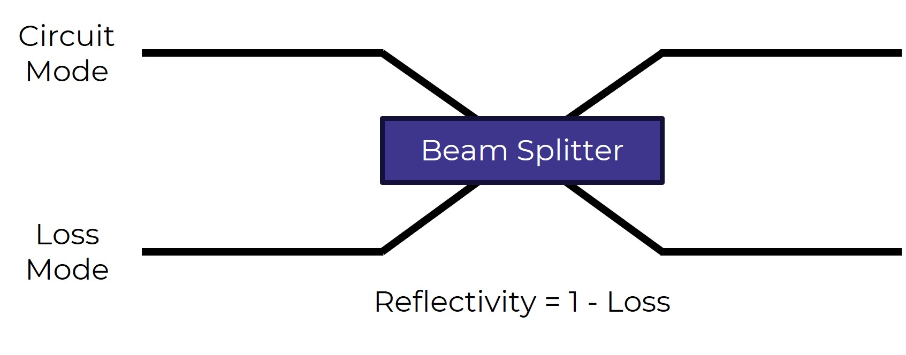

Theory
======

Linear optics
-------------

The emulator is designed primarily for the simulation of boson sampling in linear optic circuits. Boson sampling is a form of photonic quantum computing in which a given photon input state is modified by an interferometer and the output examined. This is useful as it turns out to be equivalent to calculating the permanent of the unitary matrix, a problem which classically is #P-hard. This means that potentially this framework enables a quantum advantage in linear optic systems. 

Despite this, we are still able to calculate the permanent for small mode/photon numbers (otherwise the Emulator wouldn't work) and can therefore simulate the evolution of a quantum state through a linear optic circuit. First, we are required to calculate the effective unitary of the circuit. This is achieved by multiplying together the unitary matrices of each component in the target circuit. Once this unitary has been calculated, for a given input/output the permanent calculation can be applied to find the probability amplitude of the operation.

The permanent calculation first requires the conversion of the unitary matrix, U, into the matrix used for calculation. This is dependent on the input and output state of choice. To find the matrix, we loop over the number of photons in each mode of the provided input and output, taking elements of the unitary corresponding to these values. For example, for the input :math:`\ket{1,0,1,1}` and output :math:`\ket{0,2,1,0}`, the matrix used in the calculation will be:

.. math::
    U_{perm} = 
    \begin{bmatrix}
        u_{2,1} & u_{2,3} & u_{2,4} \\
        u_{2,1} & u_{2,3} & u_{2,4} \\
        u_{3,1} & u_{3,3} & u_{3,4} \\
    \end{bmatrix}

where $u_{i,j}$ are the matrix elements of U. Once this has been found, the probability amplitude $\alpha$ of the target output state is calculated as:

.. math::
    \alpha = \frac{\text{PERM}(U_{perm})}{\sqrt{(\prod\limits_{i}x_i!)(\prod\limits_{j}y_j!)}},

where $x_i$ and $y_i$ are the photon numbers of the modes of the input and output states respectively. As we calculate the permanent for a particular input and output, calculating the full output state for a given input therefore requires finding all possible outputs and performing the permanent calculation to find the probability amplitude of each. 

Simulation of loss
------------------

As noted earlier, the emulator deals with linear optic circuits, meaning that in principle any operations should be photon number conserving, and it should not be possible to include loss. There is, however, a trick we can use to achieve loss simulation with linear-optic components. This involves the addition of some additional modes to the circuit, which are imaginary loss modes. For each instance of loss in the photonic circuit, we use a beam splitter to couple the circuit mode with a loss mode and controllably remove photons with a given probability. An example of this is shown in the figure below. Each loss mode can only be used once and so this means that the number of loss modes can grow very quickly for a circuit with a large amount of lossy components. For example, an 8 mode interferometer typically requires at least 56 loss modes, meaning it is necessary to be careful with circuit size when simulating loss. 

