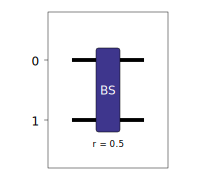
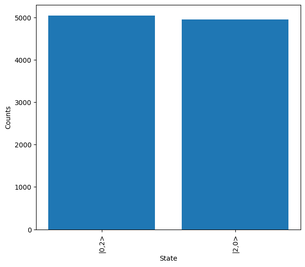

Getting Started
===============

Introduction
------------
To get start we will build a circuit to simulate the Hong-Ou-Mandel (HOM) effect with a single 50:50 beam splitter, and demonstrate the typical process flow of the Lightworks.

HOM interference can be seen when two indistinguishable photons are incident on a 50:50 beam splitter. Classically, when this occurs, we would expect that 50% of the time the photons go to the same output and 50% of the time they go to a different output. Instead, we see that both photons always travel to the same output, as is shown below.

    
    HOM interference occurring on a 50:50 beam splitter.

First Circuit
-------------

First we need to import the Lightworks and the emulator with the following:

.. code-block:: Python

    import lightworks as lw
    from lightworks import emulator

We will configure a circuit to simulate by creating a new Circuit object. This Circuit object is one of the key components of Lightworks and is used in almost all interactions with it.

.. code-block:: Python

    circuit = lw.Circuit(2)

Next, we add the beam splitter to the circuit, this is achieved with the ``add_bs`` method. The default reflectivity of a beam splitter is 0.5 (50%), so we do not need to specify this. The value we specify in the method arguments is the first mode which we place the beam splitter on. By default, if we don't specify a second mode then it will be set to the first argument + 1, so below we could have equivalently used ``add_bs(0,1)``.

.. code-block:: Python

    circuit.add_bs(0)

.. note::
    Like Python itself, indexing in Lightworks starts from 0, meaning this is always the first mode. So for example, in a 4 mode circuit, the modes would be referred to using the indices 0, 1, 2 & 3.

Once we have a circuit, we can then view the created circuit using the display method. For the circuit above this will produce the following:

Which, as expected, is a single 50:50 beam splitter (reflectivity = 0.5) across the two modes. For more information about the exact usage of circuit all of its components, visit the :doc:`sdk/circuit` section.

Initial Simulation
------------------

Once we have built a circuit, we can then move on to simulating it with the emulator. For the simulation, we will need to define the state which we wish to input into the system. This is achieved with the :doc:`sdk_reference/state` object, which takes a list of the number of photons in each mode as its input.

.. code-block:: Python

    input_state = lw.State([1,1])

The exact functionality of the State object is discussed further in the :doc:`sdk/state` section.

For this initial simulation, we will choose to use the :doc:`emulator_reference/sampler` to emulate the process of measuring photon outputs after they have propagated through the system. On creation of the Sampler, we specify the circuit and the input state to sample from. We then use the ``sample_N_outputs`` method to generate N samples from the system, in this case choosing N = 10000. We will also specify a random seed to ensure results are reproducible, but this is optional.

.. code-block:: Python

    sampler = emulator.Sampler(circuit, input_state)
    results = sampler.sample_N_outputs(10000, seed = 1)

This produces a :doc:`emulator_reference/sampling_result` object, we can quickly the contents of this using the print statement.

.. code-block:: Python

    print(results)
    # Output: {State(|2,0>): 4990, State(|0,2>): 5010}

Alternatively, we can use the ``show`` method to quickly create a plot of the measured output states.

.. code-block:: Python

    results.plot(show = True)

As expected, in near equal numbers we measure the states :math:`\ket{2,0}` and :math:`\ket{0,2}`, with the variation only existing due to the probabilistic nature of the system.

Distinguishable Photons
^^^^^^^^^^^^^^^^^^^^^^^

With the emulator, we can also simulate distinguishable particles, to confirm that the HOM interference is no longer present. This is possible by defining a :doc:`emulator_reference/source` to use with the Sampler, and setting the value of the source indistinguishability to 0. We can then resample from the system and plot.

.. code-block:: Python

    source = emulator.Source(indistinguishability = 0)
    sampler = emulator.Sampler(circuit, input_state, source = source)

    results = sampler.sample_N_outputs(10000, seed = 1)
    results.plot(show = True)

From the above, we see that in the case of distinguishable photons then approximately 50% of the time the photons will go to separate outputs of the circuit. 

Next Steps
----------

To find more about the usage of the different components of Lightworks head to the :doc:`sdk/index` and :doc:`emulator/index` sections. Alternatively, go to the :doc:`examples/index` section to see the different ways in which Lightworks can be utilised.