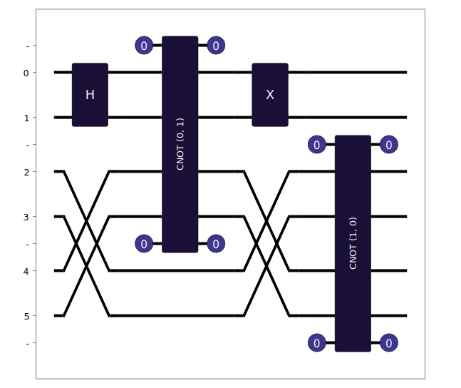
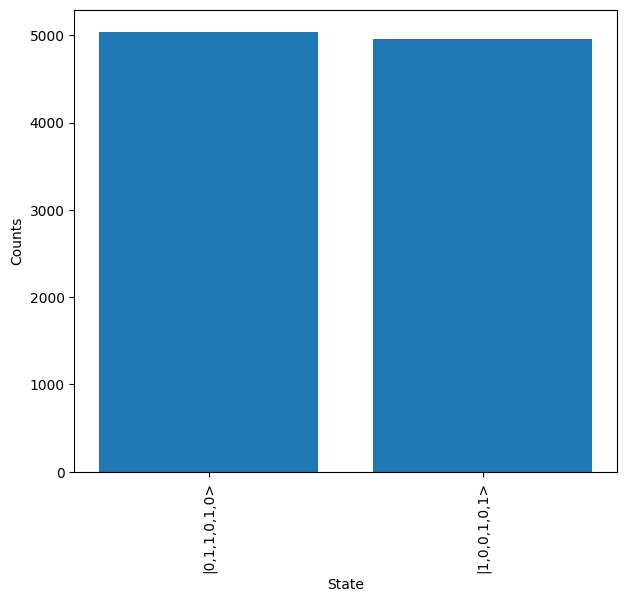

Circuit Conversion
==================

The Lightworks Qubit module contains methods for converting between quantum programming languages, aimed at making it easier to move between and compare them. The included conversion options are discussed below:

Qiskit
------

The :func:`lightworks.qubit.qiskit_converter` function can be used to perform conversion between a provided qiskit `QuantumCircuit <https://docs.quantum.ibm.com/api/qiskit/qiskit.circuit.QuantumCircuit>`_ and a lightworks :doc:`../sdk_reference/photonic_circuit`.

To use this, it should be first be imported from Qubit. An exception will be raised if attempting to use the converter without the qiskit requirements installed, for mode info see :ref:`Qubit Usage <qubit_usage>` 

.. code-block:: Python

    from lightworks.qubit import qiskit_converter
    from qiskit import QuantumCircuit

To demonstrate the converter, a qiskit QuantumCircuit should then be defined. In this case a 3 qubit circuit is chosen with a Hadamard, X-gate and 2 CNOTs.  

.. code-block:: Python

    qc = QuantumCircuit(3)
    qc.h(0)
    qc.cx(0,2)
    qc.cx(2,1)
    qc.x(0)

    qc.draw(output="mpl")

.. image:: assets/qiskit_circuit_demo.png
    :scale: 100%
    :align: center

The Lightworks circuit is then created by providing this circuit directly to the ``qiskit_converter`` function. The created circuit can then be displayed.

.. code-block:: Python

    conv_circ, _ = qiskit_converter(qc)

    conv_circ.display()

.. image:: assets/converted_qiskit_circuit_demo.svg
    :scale: 75%
    :align: center

From this circuit, there are a couple of things to note. The first is that the first CNOT (acting on qubits 0 & 2) has been replaced by a CNOT and two swap gates. This occurs because the photonic CNOT gate must act on adjacent modes, so the converter will automatically include swaps to ensure this is the case. In some cases this may lead to circuits which are non-optimal, and so a lower depth circuit may be possible by manually including swap components in these cases. The other thing to note is that in the second CNOT gate, the text '(1, 0)' is included in the gate label, this is used to indicate that the lower qubit modes (those representing qubit two) are acting as the control qubit and the upper modes are acting as the target qubit. These labels will always be relative to the smaller of first qubit which the gate is acting on instead of showing absolute qubit numbers.

Post-selection
^^^^^^^^^^^^^^

By default, the ``qiskit_converter`` will produce circuits which do not require any post-selection, however it is possible to change this behaviour, which may be desirable as the post-selected versions of gates tend to be more resource efficient. This is achieved with the ``allow_post_selection`` option.

.. code-block:: Python

    conv_circ, post_select = qiskit_converter(qc, allow_post_selection=True)

    print(post_select.rules)
    # Output: [Rule(modes=(0, 1), n_photons=(1,)), Rule(modes=(2, 3), n_photons=(1,)), Rule(modes=(4, 5), n_photons=(1,))]

    conv_circ.display()

When used, a ``PostSelection`` object will also be returned, which can then be provided to the other components of Lightworks. As an example, below it is used with Sampler to enforce the correct transformation is implemented.

.. code-block:: Python

    sampler = emulator.Sampler(
        conv_circ, lw.State([1,0,1,0,1,0]), 10000, 
        post-selection = post_select, random_seed = 995
    )

    backend = emulator.Backend("slos")
    results = backend.run(sampler)
    
    results.plot()

.. note::

    The converter supports inclusion of a CCZ or CCX/Toffoli gate, but currently only the post-selected version of this gate is implemented within Lightworks. This means it will usually have to be placed toward the end of any circuit which features multi-qubit gates. An error will be raised by the algorithm if it is unable to find a compatible configuration with these gates.