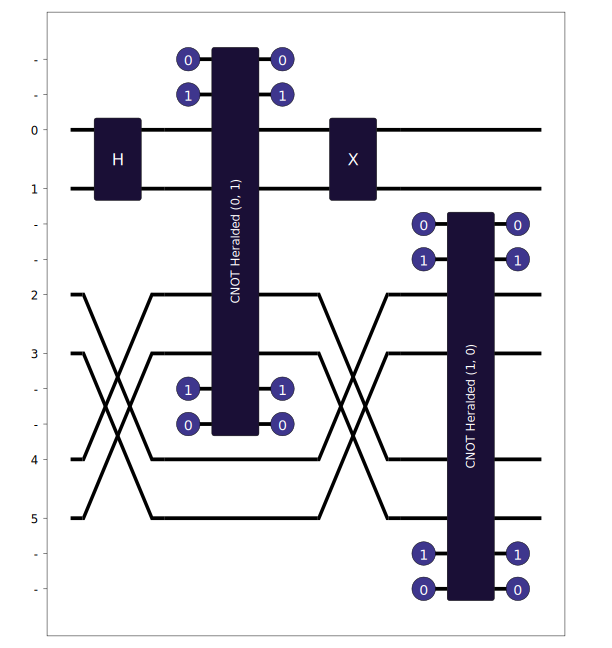

Circuit Conversion
==================

Desc

Qiskit
------

The :func:`lightworks.qubit.converter.qiskit_converter` function can be used to perform conversion between a provided qiskit `QuantumCircuit <https://docs.quantum.ibm.com/api/qiskit/qiskit.circuit.QuantumCircuit>`_ and a lightworks :doc:`../sdk_reference/circuit`.

.. code-block:: Python

    from lightworks.qubit.converter import qiskit_converter
    from qiskit import QuantumCircuit

.. code-block:: Python

    qc = QuantumCircuit(3)
    qc.h(0)
    qc.cx(0,2)
    qc.cx(2,1)

    qc.draw(output="mpl")

.. code-block:: Python

    conv_circ = qiskit_converter(qc)

    conv_circ.display()

