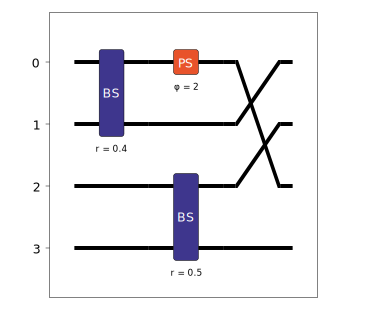
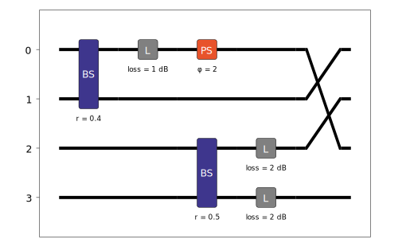
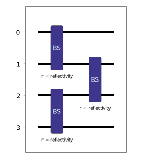
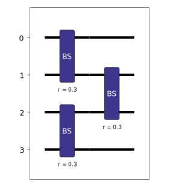
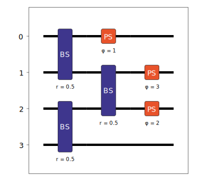
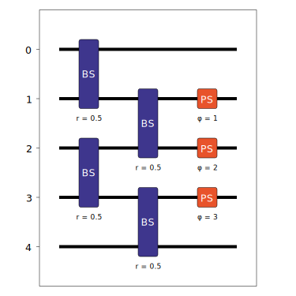
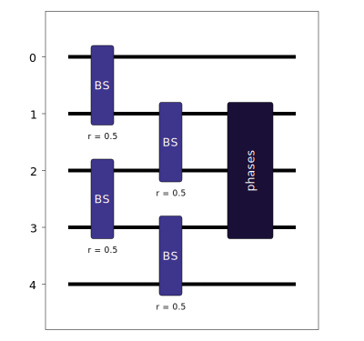

Circuit
=======

The Circuit is one of the key components of the Lightworks. It is typically the main interaction point for users and allows for an algorithm to be encoded for implementation on a photonic quantum computing system.

.. note that somewhere here there will need to be a note on what loss is and how it is included.

Building Circuits
-----------------

A circuit is initialized by calling the circuit object, and only requires the number of modes used in the circuit to be specified. For example, to create a circuit with 4 modes the required code would be:

.. code-block:: Python

    circuit = lw.Circuit(4)

Once a circuit has been created, it is then possible to view the number of modes with the ``n_modes`` attribute.

.. code-block:: Python

    print(circuit.n_modes)
    # Output: 4

There is also a number of additional attributes. ``U`` will provide the effective unitary of the circuit, this is altered by any loss elements included in the system. ``U_full`` will then provide the full unitary including any of the invisible loss modes included for loss elements.

We can then begin to add components to the circuit, the following are included as part of the Circuit object and can be added with their corresponding methods.

.. list-table:: Circuit components
    :widths: 25 25 50
    :header-rows: 1

    * - Component
      - Method
      - Options
    * - :ref:`Beam Splitter <beamsplitter>`
      - ``add_bs``
      - Modes, Reflectivity, Loss, Convention
    * - :ref:`Phase Shifter <phaseshifter>`
      - ``add_ps``
      - Mode, Phase shift, Loss
    * - :ref:`Mode Swaps <modeswaps>`
      - ``add_mode_swaps``
      - Swaps, Element Loss
    * - :ref:`Loss Element <losselement>`
      - ``add_loss``
      - Mode, Loss
    * - :ref:`Separations <separations>`
      - ``add_separation``
      - Modes

Below, a sub-section is dedicated to each component, with more information about how each component can be used and their options.

.. _beamsplitter:

Beam Splitter
^^^^^^^^^^^^^

A beam splitter is used to controllably couple two modes, with the exact nature of the coupling defined by the reflectivity of the splitter (also often referred to using an angle :math:`\theta`).

To include a beam splitter in a circuit the ``add_bs`` method is used, at minimum it requires the first mode that the beam splitter will be placed on to be specified. By default, if the second mode isn't specified then this will be set to the first mode + 1. So the following function calls will be equivalent:

.. code-block:: Python

    circuit.add_bs(0)
    circuit.add_bs(0, 1)

The reflectivity of the beam splitter can be adjusted by specifying the ``reflectivity`` option in the method. It should be provided as a decimal value, with the default value being 0.5. The beam splitter convention can also be adjusted if required, it defaults to Rx, with the available options being:

.. list-table:: Beam splitter conventions
    :widths: 40 60
    :header-rows: 1

    * - Convention
      - Unitary
    * - Rx
      - .. math:: \begin{bmatrix}
                      \cos{\theta/2} & i\sin{\theta/2} \\
                      i\sin{\theta/2} & \cos{\theta/2} \\
                  \end{bmatrix}
    * - H
      - .. math:: \begin{bmatrix}
                      \cos{\theta/2} & \sin{\theta/2} \\
                      \sin{\theta/2} & -\cos{\theta/2} \\
                  \end{bmatrix}

Where :math:`\theta = \cos^{-1}(\sqrt{\text{reflectivity}})`. As an example, if we wanted to add a beam splitter across modes 1 & 2, with reflectivity of 0.4 and using the 'H' convention, the function call would be:

.. code-block:: Python

    circuit.add_bs(1, reflectivity = 0.4, convention = "H")

When using the emulator to simulate a circuit, it is also possible to include loss for components with the ``loss`` option, this will be included as a separate loss element on each of the two modes that the beam splitter acts over. If we therefore wanted to extend the function call above to include a beam splitter loss of 0.3 dB then it would look like:

.. code-block:: Python

    circuit.add_bs(1, reflectivity = 0.4, convention = "H", loss = 0.3)

.. warning:: 
    All losses in Lightworks should be provided as a positive dB loss value. To provide loss as a decimal transmission value instead, the ``transmission_to_db_loss`` function can be used. For a transmission of 80%, the function call above would therefore look like:

  .. code-block:: Python

    circuit.add_bs(1, reflectivity = 0.4, convention = "H", loss = lw.transmission_to_db_loss(0.8))

.. _phaseshifter:

Phase Shifter
^^^^^^^^^^^^^

A phase shifter acts to apply a phase to a single mode of the circuit. They are added to the circuit with the ``add_ps`` method, which requires the mode number it will act on and the phase shift that is to be applied. A phase shifter can also optionally introduce a loss on the mode if this is required. As an example of this, if we wanted to add a phase shift of 2 on mode 1 of the circuit, and include a 0.5 dB loss, then the method call should look like:

.. code-block:: Python

    circuit.add_ps(1, 2, loss = 0.5)

.. _modeswaps:

Mode Swaps
^^^^^^^^^^

The mode swaps component can be used to very quickly rearrange the mode configuration of a circuit, without worrying about having to determine the exact sequence of swaps that would be required. To specify the mode swaps to be implemented a dictionary should be provided to the ``add_mode_swaps`` method, where the keys of the dictionary describe the initial modes and the values describe the final mode positions. If we were aiming to swaps modes 0 & 2 of a circuit, this might look like:

.. code-block:: Python

    circuit.add_mode_swaps({0:2, 2:0})

It is also possible to implement more complex configurations though. For example, in a 4 mode circuit the following reconfiguration may be implemented:

.. code-block:: Python

    circuit.add_mode_swaps({0:2, 2:3, 3:1, 1:0})

This would map 0 :math:`\rightarrow` 2, 2 :math:`\rightarrow` 3, 3 :math:`\rightarrow` 1 and 1 :math:`\rightarrow` 0.

.. note::
    The provided mode swap dictionary must be complete, meaning all modes used in the swap (not necessarily all circuit modes) have an initial and final destination. This can be checked easily by comparing the keys and values of the swaps dictionary and confirming they are equivalent. An error will be raised if a provided set of swaps is incomplete.

.. _losselement:

Loss Element
^^^^^^^^^^^^

A loss element is used to implement a dedicated source of loss to a mode of a photonic circuit. They are added through the ``add_loss``, which requires the mode to implement the loss on and the value of the loss in dB. It is important to note that adding loss elements to a circuit will introduce additional invisible modes to the circuit. This will increase runtime when simulating a circuit, so users should endeavour to minimize additional loss elements where possible. 

To add a loss component on mode 1 of a circuit, with value of 3dB, the method call should look like:

.. code-block:: Python

    circuit.add_loss(1, 3)

.. _separations:

Separations
^^^^^^^^^^^

The ``add_separation`` method only affects how circuits are displayed by the visualization functions, and does not alter the actual functionality of the circuit. It is useful as it allows for different aspects of a circuit to be spatially separated allow for a user to see which components correspond to a particular functionality they are trying to implement. 

When adding a separation, a list of the modes which it should be applied to is provided, alternatively if no arguments are provided to the function then it will be applied across all modes of the circuit.

.. code-block:: Python

    # Apply to all circuit modes
    circuit.add_separation()
    
    # Apply to modes 0, 2, 4
    circuit.add_separation([0,2,4])

Visualization
-------------

Once a circuit has been created, the created configuration can be viewed with the ``display`` method. To demonstrate this, we will create a new circuit which uses all of the components above.

.. code-block:: Python

    circuit = lw.Circuit(4)
  
    circuit.add_bs(0, reflectivity = 0.4)
    circuit.add_loss(0, 1)
    circuit.add_separation()
    circuit.add_bs(2, loss = 2)
    circuit.add_ps(0, 2)
    circuit.add_mode_swaps({0:2,2:1,1:0})

The ``display`` method is then called on the circuit.

.. code-block:: Python
  
    circuit.display()

From the circuit above, there is a few things to note. The first is that the beam splitter across modes 2 and 3 is not inline with the other beam splitter, this is directly as a result of the ``add_separation`` method used in the circuit, which creates a horizontal distinction between them. It may be useful to recreate this circuit and remove the separation so the effect of this can be seen. The other thing to note is that the loss elements, both those included with the beam splitter and the dedicated ``add_loss`` call are not shown. This is because we need to use the display_loss option to choose to show this. Implementing this option yields:

.. code-block:: Python
  
    circuit.display(display_loss = True)

For advanced users, rather than calling the ``display`` method of the Circuit, it is instead possible to use the included :doc:`../sdk_reference/display` object. Instead of displaying the circuit as soon as it is called, it will return the pyplot/drawing object, allowing this to be modified or saved to file directly.

Parameterization
----------------

Circuits in Lightworks support parameterization through a dedicated :doc:`../sdk_reference/parameter` object included within the module. This allows for different values in the circuit to be modified after circuit creation, which can simplify the process of adjusting circuits. This Parameter object has a range of functionalities, which are detailed in the :doc:`parameters` section. To parametrize a circuit, we will start by defining a parameter, which we assign an initial value to and can optionally include a label which will be used when displaying.

.. code-block:: Python
    
    parameter = lw.Parameter(0.5, label = "reflectivity")

We can then use this in a circuit, providing the parameter object in place of the normal value.

.. code-block:: Python

    circuit = lw.Circuit(4)

    circuit.add_bs(0, reflectivity = parameter)
    circuit.add_bs(2, reflectivity = parameter)
    circuit.add_bs(1, reflectivity = parameter)

When then viewing this circuit with ``display``, we will see that by default the parameter value is replaced by the provided label.

.. code-block:: Python

    circuit.display()

To instead view the circuit with the actual parameter values we use ``show_parameter_values = True`` in the display method.

.. code-block:: Python

    circuit.display(show_parameter_values = True)

It is then possible to update the parameter value using the ``set`` method of the parameter. If this is updated to 0.3 it can be seen how this is then altered in the circuit visualization. 

.. code-block:: Python

    parameter.set(0.3)
    circuit.display(show_parameter_values = True)

This is the core functionality of Parameters in the circuit. It is also possible to store Parameters in the custom :doc:`../sdk_reference/parameter_dict` object, allowing for easy management and modification of parameters without having to assign each created Parameter to a distinct variable. It is recommended that this is utilized for any more than a couple of parameters. This is discussed further in the :doc:`parameters` section.

.. note::
    Only certain aspects of a circuit can be parameterized, this includes phase shifts, beam splitter reflectivities and loss values. The mode number that elements are placed on cannot be parameterized. Some caution should also be used, as if the value of the parameter is altered some it becomes invalid for the quantity it is assigned to, then this will raise a compilation error when the circuit is attempted to be used. 

Combining Circuits
------------------

Circuits also support addition, meaning it is possible to create sub-circuits with specific functionality and then combine them as required. There are two ways to do this.

The first is through the use of the ``+`` operator. This is simpler, but only supports the addition of equally size circuits. An example of this is shown below, in which a circuit with a number of beam splitters is created and another with a number of phase shifters, these are then combined.

.. code-block:: Python

    circuit_bs = lw.Circuit(4)
    circuit_bs.add_bs(0)
    circuit_bs.add_bs(2)
    circuit_bs.add_bs(1)

    circuit_ps = lw.Circuit(4)
    circuit_ps.add_ps(0, 1)
    circuit_ps.add_ps(2, 2)
    circuit_ps.add_ps(1, 3)

    new_circuit = circuit_bs + circuit_ps
    new_circuit.display()

The other way to combine circuits is through the ``add`` method, which allows for a smaller circuit to be added to a larger circuit. With the ``add`` method, it is also possible to choose which mode of the larger circuit the smaller circuit starts on. For example, in the following we create a 5 and 3 mode circuit, comprised of beam splitters and phase shifters respectively, and choose for the circuit being added to start on mode 1 of the larger circuit.

.. code-block:: Python

    circuit_bs = lw.Circuit(5)
    circuit_bs.add_bs(0)
    circuit_bs.add_bs(2)
    circuit_bs.add_bs(1)
    circuit_bs.add_bs(3)

    circuit_ps = lw.Circuit(3)
    circuit_ps.add_ps(0, 1)
    circuit_ps.add_ps(1, 2)
    circuit_ps.add_ps(2, 3)

    circuit_bs.add(circuit_ps, 1)
    circuit_bs.display()

It can also be seen how unlike when using ``+`` the ``add`` method does not return a new circuit, and instead adds it to the existing created circuit.

.. note:: 
    The starting mode of the smaller circuit + the number of modes in the smaller circuit must be less than or equal to the number of modes in the larger circuit. For example, when adding a 4 mode circuit to a 6 mode circuit, then the 4 mode circuit could start on mode 0, 1 or 2. 

When using ``add``, it is also possible to choose to group all of the elements being to the smaller circuit into a single component. This has no functional effect on the circuit but can be useful when viewing the created circuit. A name can also be provided which is shown in the display. In this case we will choose to label the circuit as phases. 

.. code-block:: Python

    circuit_bs = lw.Circuit(5)
    circuit_bs.add_bs(0)
    circuit_bs.add_bs(2)
    circuit_bs.add_bs(1)
    circuit_bs.add_bs(3)

    circuit_ps = lw.Circuit(3)
    circuit_ps.add_ps(0, 1)
    circuit_ps.add_ps(1, 2)
    circuit_ps.add_ps(2, 3)

    circuit_bs.add(circuit_ps, 1, group = True, name = "phases")
    circuit_bs.display()

Other Functionality
-------------------

To do...