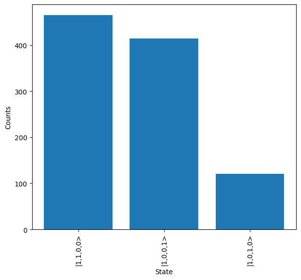
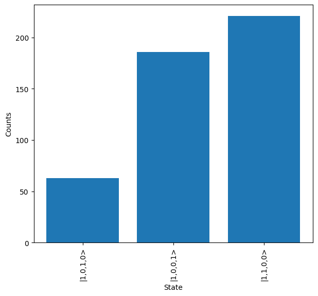

Post-selection
==============

Post-selection if often a key part of linear optic quantum computing, enabling the non-linear transformations required for multi-qubit gates and other applications. It can be achieved in Lightworks through two different methods, either with the :class:`PostSelection <lightworks.PostSelection>` or with a custom function / :class:`PostSelectionFunction <lightworks.PostSelectionFunction>` for the application of more complex criteria.

Configuration
-------------

To start, we need to be able to configure the required post-selection for a job. The different ways this can eb achieved are discussed below.

PostSelection
^^^^^^^^^^^^^

The ``PostSelection`` object allows the number of photons to be specified on a mode or across a number of modes. To start, a new post-selection object is created. Optionally, it can be allowed for multiple rules to apply to a particular mode with the ``multi_rules`` argument, but this is off by default.

.. code-block:: Python

    post_selection = lw.PostSelection()

Then, rules can be added with the ``add`` method. For each rule the mode(s) it applies to is specified as the first argument and the photon(s) required to be measured as the second argument. When multiple modes are provided, it will be required that the sum of the photons across these modes is equal to the provided photon numbers. As an example, if we wanted to measure 2 photons across modes 0 and 1 of a circuit then the following would be used:

.. code-block:: Python

    post_selection.add((0, 1), 2)

In this case, the valid states would be :math:`\ket{2, 0}`, :math:`\ket{0, 2}` and :math:`\ket{1, 1}`. If in doubt, the validity of a state can be checked using the ``validate`` method.

.. code-block:: Python

    print(ps.validate(lw.State([1, 1])))
    # Output: True

    print(ps.validate(lw.State([1, 0])))
    # Output: False

    print(ps.validate(lw.State([1, 1, 0, 2])))
    # Output: True

As mentioned, any combination of photon numbers and modes can be used, so all of the following will be valid configurations:

.. code-block:: Python

    post_selection.add(2, 1) # Require measuring 1 photon on mode 2
    post_selection.add(3, (1, 2)) # Require measuring 1 or 2 photons on mode 2
    post_selection.add((4, 5, 6), (1, 2)) # Require measuring 1 or 2 photons across modes 4, 5 & 6

.. note::

    Heralded modes are excluded from post-selection, so it is important to remember to remove these.

PostSelectionFunction
^^^^^^^^^^^^^^^^^^^^^

For more complex criteria, a custom function could be used to specify post-selection. In the majority of cases it is sufficient to supply this function directly to the various places this is used within Lightworks, but if in doubt it can also be wrapped in ``PostSelectionFunction`` to enable the use of the ``validate`` method.

As an example, if we wanted to measure an even number of photons across the first 3 modes of a state and an odd number across the last 3 modes, then the following could be used.

.. code-block:: Python

    post_selection_func = lambda s: sum(s[:3])%2 == 0 and sum(s[-3:])%2 == 1

    def post_selection_func(s):
        return sum(s[:3]) % 2 == 0 and sum(s[-3:]) % 2 == 1

There is no difference between using a formal Python function or the lambda function here.

In the case where we want to wrap this in the ``PostSelectionFunction``, this is achieved with:

.. code-block:: Python
    
    post_selection = lw.PostSelection(post_selection_func)

As mentioned, we can then use validate to test the state, for example:

.. code-block:: Python

    post_selection.validate(lw.State([1, 1, 0, 0, 1, 0]))
    # Output: True

    post_selection.validate(lw.State([1, 2, 0, 0, 1, 0]))
    # Output: False

Utilisation
-----------

Once, we have post-selection configured, this can then be provided to either the task or result objects to apply it. First, a new post-selection criteria is defined, requiring one photon on the first mode (mode 0) of a circuit.

.. code-block:: Python

    post_selection = lw.PostSelection()
    post_selection.add(0, 1)

The usage of this is then demonstrated below.

Tasks
^^^^^

In tasks that support post-selection, this can be provided using the post_selection argument on initialisation of the task. For example, with the sampler, the post-selection would be added with:

.. code-block:: Python

    circuit = lw.Unitary(lw.random_unitary(4, seed=2))
    input_state = lw.State([1, 1, 0, 0])
    n_samples = 1000

    sampler = lw.Sampler(
        circuit, input_state, n_samples, post_selection=post_selection, random_seed=2
    )

This can then be run on a backend and the results plotted. It can be seen that, as expected, only results with one photon on the first mode are produced.

.. code-block:: Python

    backend = emulator.Backend("slos")

    results = backend.run(sampler)
    results.plot()

Results
^^^^^^^

Alternatively, after generating results, the post-selection can be applied directly to this object. First, the results from earlier are regenerated without post-selection being applied.

.. code-block:: Python

    circuit = lw.Unitary(lw.random_unitary(4, seed=2))
    input_state = lw.State([1, 1, 0, 0])
    n_samples = 1000

    sampler = lw.Sampler(circuit, input_state, n_samples, random_seed=2)

    backend = emulator.Backend("slos")

    results = backend.run(sampler)

The post-selection is then added to the result with the ``apply_post_selection`` method. This generates a new result object. When plotting this, it can again be seen how there is always one photon on the first mode.

.. code-block:: Python

    ps_results = results.apply_post_selection(post_selection)
    ps_results.plot()

