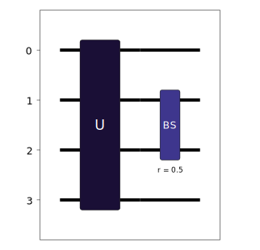
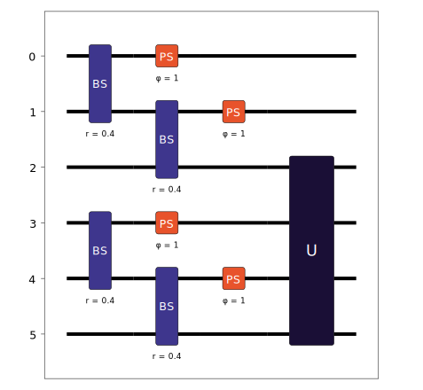

Unitary
=======

In some cases, it is necessary to implement a target unitary as part of a circuit. Included with Lightworks is the :class:`Unitary <lightworks.Unitary>` object, which enables this without having to worry about programming the exact beam splitters and phase shifters required to create the circuit.

Usage
-----

To use the unitary component, first the unitary to implement should be specified as an array, in this case a random unitary is generated with the built-in function. This unitary matrix should then be provided to the Unitary object to create the target transformation.

.. code-block:: Python

    U = lw.random_unitary(4)

    unitary = lw.Unitary(U)

The Unitary object is a child class of PhotonicCircuit, this means it behaves in the same way and offers access to all the same methods and attributes. For example, the number of modes can be viewed and additional components, such as a beam splitter, can be added. The created circuit can also be viewed, where the unitary component will be displayed with a U.

.. code-block:: Python

    print(unitary.n_modes)
    # Output: 4

    # Add beam splitter
    unitary.bs(1)

    # Display
    unitary.display()

Addition to Circuits
--------------------

As Unitary objects are a subclass of PhotonicCircuit, they are also compatible with the ``add`` method, meaning it is possible to add a Unitary to an existing, potentially larger, circuit. Below, a 4x4 unitary transformation is added to the last 4 modes of a created 6 mode circuit.

.. code-block:: Python

    circuit = lw.PhotonicCircuit(6)
    for m in [0, 3, 1, 4]:
        circuit.bs(m, reflectivity = 0.4)
        circuit.ps(m, 1)

    unitary = lw.Unitary(lw.random_unitary(4))

    # Add unitary to circuit
    circuit.add(unitary, 2)
    
    # Display
    circuit.display()

